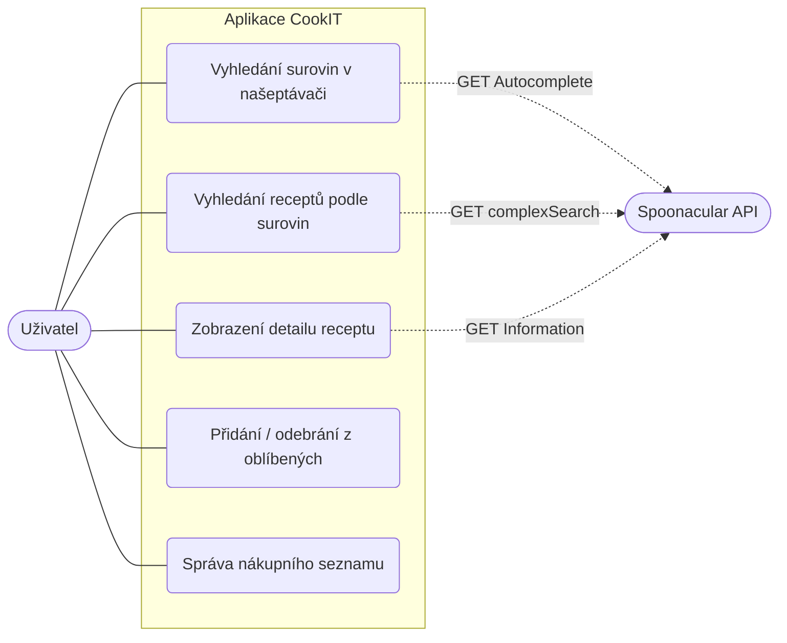

# CookIT

> Webová aplikace typu **SPA** (Single Page Application) s prvky **PWA** (Progressive Web App).

---

## 1. Účel aplikace

CookIT je aplikace sloužící k vyhledávání receptů na základě surovin, které má uživatel aktuálně k dispozici. Umožňuje zobrazení detailů receptů (nutriční hodnoty, postup přípravy), ukládání receptů do oblíbených a tvorbu nákupního seznamu chybějících surovin.

---

## 2. Zadání projektu

Cílem projektu bylo vytvořit interaktivní webovou aplikaci využívající externí API. 
**Součástí požadavků je:**
- Oddělení struktury (`HTML`), vzhledu (`CSS`) a logiky (`JS`).
- Komunikace s veřejným API (získávání a zpracování `JSON` dat).
- Ukládání uživatelských dat (oblíbené položky, nákupní seznam) na straně klienta.
- Zajištění alespoň částečné funkčnosti v offline režimu pomocí `Service Workeru`.
- Základní technická dokumentace a Use-Case diagram.

---

## 3. Struktura projektu

```text
CookIT/
├── index.html       # Hlavní a jediný HTML soubor aplikace (SPA struktura)
├── style.css        # Kompletní stylování aplikace s využitím CSS proměnných a responzivního gridu
├── app.js           # Hlavní aplikační logika (DOM manipulace, API volání, state management)
├── sw.js            # Service Worker obsluhující offline režim a kešování (PWA)
├── config.js        # Konfigurační soubor obsahující API klíč (není verzován s reálným klíčem)
├── manifest.json    # Manifest soubor pro instalaci PWA aplikací
├── img/             # Složka se statickými obrázky a ikonami pro PWA
└── README.md        # Technická dokumentace projektu
```

---

## 4. Použité API endpointy

Aplikace využívá **Spoonacular API** pro získávání receptů a ingrediencí.

1. **Získání našeptávače ingrediencí**
   - **`GET`** `https://api.spoonacular.com/food/ingredients/autocomplete`
   - **Parametry:** `query` (hledaný text), `number` (počet výsledků).
   - **Využití:** Modální okno pro vyhledávání a přidávání surovin (s využitím debounce pro omezení počtu requestů).

2. **Vyhledání receptů podle ingrediencí**
   - **`GET`** `https://api.spoonacular.com/recipes/complexSearch`
   - **Parametry:** `includeIngredients` (čárkou oddělený seznam), `number` (max počet), `sort`, `addRecipeNutrition=true`.
   - **Využití:** Hlavní vyhledávací funkce. Získá seznam základních informací o receptech (včetně kalorií) na základě vybraných tagů.

3. **Detail konkrétního receptu**
   - **`GET`** `https://api.spoonacular.com/recipes/{id}/information`
   - **Parametry:** `id` (ID receptu), `includeNutrition=true` (včetně nutričních hodnot).
   - **Využití:** Kliknutí na kartu receptu vyvolá tento endpoint k získání postupu, kompletního seznamu surovin a nutričních informací.

---

## 5. Princip fungování jednotlivých částí aplikace

### A) State Management (Stav aplikace)

Aplikace drží veškerá data v paměti na straně klienta. 
- **`selectedIngredients`**: Pole aktuálně zvolených surovin pro vyhledávání.
- **`favorites`**: Pole objektů s oblíbenými recepty. Trvale uloženo v prohlížeči pomocí `localStorage`.
- **`shoppingList`**: Pole objektů mapujících chybějící suroviny na konkrétní recepty. Uloženo v `localStorage`.

### B) Vyhledávání a stránkování (app.js)

Při psaní do vyhledávacího pole se aktivuje časovač (Debounce 500ms). Až uživatel dopíše, odešle se požadavek na Spoonacular API. Vybrané ingredience se ukládají jako štítky (tagy). Kliknutím na vyhledat se stáhne dávka až 50 receptů. Aplikace je drží v paměti a uživateli je vykresluje postupně po 10 kusech (lokální stránkování přes tlačítko "Další recepty").

### C) Správa oblíbených a nákupní seznam (app.js)

Funkce pro přidání/odebrání do oblíbených manipuluje se stavem v poli `favorites` a synchronizuje změnu napříč celým UI (změna barvy srdíček ve výpisu i v detailu). Pokud uživatel přidá do oblíbených recept, o kterém nemá appka plná data (jen fotku z výpisu), volá se asynchronně funkce na pozadí, která dotáhne z API potřebné informace (pro offline využití).

Suroviny lze z detailu přidávat do nákupního seznamu (opět synchronizováno do pole a `localStorage`). Ve výpisu nákupů se data pomocí redukce seskupují do logických bloků podle názvů receptů (Dictionary pattern).

### D) PWA a Offline režim (sw.js)

Aplikace registruje Service Worker. Při instalaci se precacheují veškeré statické soubory (HTML, CSS, JS, ikony). Požadavky na síť jsou ošetřeny dvěma strategiemi:
1. **Spoonacular API (Recepty):** *Network First*. Pokusí se stáhnout aktuální data ze sítě. Pokud uspěje, uloží je do Cache. Pokud je zařízení offline, vrátí poslední známá data z mezipaměti.
2. **Statické soubory (Appka samotná):** *Cache First*. Pro rychlé načtení prioritně sahá do Cache, v případě absence se ptá sítě.  

Při ztrátě připojení se navíc zobrazí uživateli oranžový "Offline režim" badge v hlavičce (řešeno posluchači `online`/`offline` událostí na objektu `window`).

---

## 6. Use-Case diagram

Níže je diagram případů užití (Use-Case) zapsaný v syntaxi Mermaid (na GitHubu a kompatibilních prohlížečích se automaticky vykreslí).


